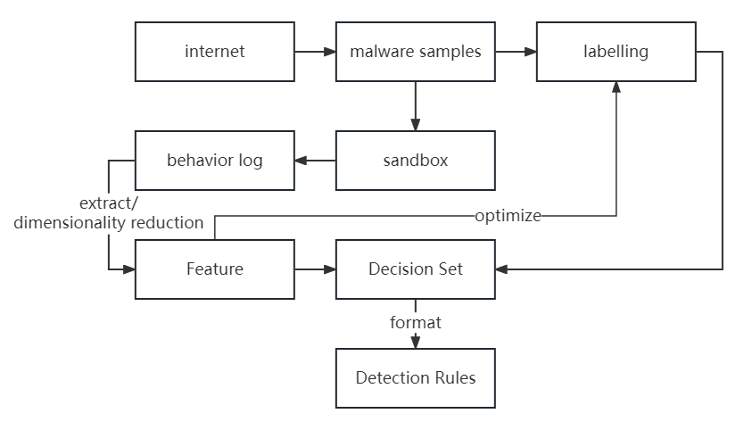

# IGG
IOC generation module source code of paper: 

**INDICATOR OF COMPROMISE-BASED MALWARE DETECTION SYSTEM RESEARCH AND IMPLEMENTATION**

We can use it to generate dectection rules from malware sandbox log.  

## Overview of IGG


## Requirements
pip3 install numpy scikit-learn progressbar pandas pyfim  
We test the code in python3.7

## Instructions for running this tool

1. Download malware and benign samples and run in cuckoo.
2. Download reports of sample from VirusTotal.
3. Use https://github.com/malicialab/avclass to label the malware samples. We need both simple result and verbose result.
4. Run extract_feature.py to extract features from cuckoo log.
5. Run generate_regexp.py to group feature and generate regexp.
6. Run optimize_class_cos.py to optimizing label of malware. If there is no label changed, then go to next step, else repeat step 5.
7. Run generate_decision_set.py to generating dicision set of dataset.
8. Transfer decision set to rule in any format you want, here we can run generate_elastic_rule.py to transfer decision set to rules in elsticsearch format.


## Directories
```
├── benign
│   ├── cuckoo
│   │   ├── # Put json format cuckoo log of benign samples here, use md5 hash of sample as filename
│   └── report
│       ├── # Put VirusTotal report of benign samples here, use md5 hash of sample as filename
├── class.csv # AVClass result
├── class.verbose.csv # AVClass verbose result
├── efficient_apriori # Implement of apriori algorithm
├── extract_feature.py # Script for extracting feature from cuckoo log
├── fim.cp39-win_amd64.pyd # Dependency of pyarc
├── generate_decision_set.py # Script for generating dicision set of dataset
├── generate_elastic_rule.py # Script for transforming dicision set to detection rule used in elasticsearch
├── generate_regexp.py # Script for grouping feature and generating regexp
├── malware
│   ├── cuckoo
│   │   ├── # Put json format cuckoo log of malware samples here, use md5 hash of sample as filename
│   └── report
│       ├── # Put VirusTotal report of malware samples here, use md5 hash of sample as filename
├── optimize_class_cos.py # Script for optimizing label of malware
├── pyarc # Implement of transection generation
├── pyids # Implement of ids algorithm
├── run.sh # all in one bash script
├── readme.md
└── overview.png
```

## Quick Start
We write an all in one bash script to automatically generate rules to **rules.ndjson**. The next **Demo** section will explain the specific steps.
```
./run.sh
```

## Demo
We use 500 malware samples from 10 families in the **malware** folder and their label result in the name of **class.csv** and **class.verbose.csv** as a demo, now we will try to generation rules from them.  
### Extract Features
Run **extract_feature.py** to extract features from cuckoo log.
```
python3 extract_feature.py
```
We will find some folders in the name of family lables in the **malware\ioc_0** folder, and text files in the folders are the original feature of the malware samples. We notice the suffix of **ioc_0** folder, it represents the round of label optimizing. 
### Group And Regexp
Set the global var **round** to 0 in **extract_feature.py** and then run **extract_feature.py** to group features and generate features with regexp
```
python3 generate_regexp.py
```
We will find results in the **malware\ioc_regexp_0** folder which have the same directory structure of **malware\ioc_0**, here are the features with regexp. 
### Optimize Label
Set the global var **round** to 0 in optimize_class_cos.py and then run **optimize_class_cos.py** to optimize the family lables
```
python3 optimize_class_cos.py
```
We will find a new file in name of **cos_0.log**, the content in it recorded the samples whose label have been optimized. If the file is empty, then we can go to  the next step, otherwise, we should plus 1 to the global var **round** in **generate_regexp.py** and **optimize_class_cos.py** and run them again until an empty **cos_x_log** file generated.  
### Generate Decision Set
Now we have the dimensionality reduction features with regexp in **malware\ioc_regexp_x** folder. Then we set the global var **log_dir** in **generate_decision_set.py** to **malware\ioc_regexp_x** and run the script. 
```
python3 generate_decision_set.py
```
We will find the decision set in the text files in **decision_set\{malware label}** folder. Here is an example, which means the malware writes a **Mira.h** in **C:\Documents and Settings\All Users\Application Data\Saaaalamm\\**
```
0##files_written##C:\Documents and Settings\All Users\Application Data\Saaaalamm\Mira.h
```
### Generate Detection Rule
Now we can generate detection rules from the decision set. The format of the rules is based on the detection system, here we use elasticsearch as the implement of detection system. We set the global var **rule_dir** in the script **generate_elastic_rule.py** to **decision_set** which is the folder of decision set, and then run it.
```
python3 generate_elastic_rule.py
```
We will find a json format file **rules.ndjson**. It's content is based on
elasticsearch query syntax. We can directly import it into elasticsearch. Here is the rule based on the sample in the **Generate Decision Set** section.
```json
{
    "id": "2118b9f3-3d6d-11ee-bab3-38f3ab90be7a",
    "updated_at": "2022-03-21T16:08:29.816Z",
    "updated_by": "elastic",
    "created_at": "2022-03-21T16:08:27.788Z",
    "created_by": "elastic",
    "name": "mira",
    "tags": [],
    "interval": "5m",
    "enabled": true,
    "description": "mira",
    "risk_score": 21,
    "severity": "low",
    "license": "",
    "output_index": ".siem-signals-default",
    "meta": {
        "from": "1m",
        "kibana_siem_app_url": "http://192.168.198.3:5601/app/security"
    },
    "author": [],
    "false_positives": [],
    "from": "now-360s",
    "rule_id": "2118b9f4-3d6d-11ee-8f2a-38f3ab90be7a",
    "max_signals": 100,
    "risk_score_mapping": [],
    "severity_mapping": [],
    "threat": [],
    "to": "now",
    "references": [],
    "version": 1,
    "exceptions_list": [],
    "immutable": false,
    "type": "query",
    "language": "lucene",
    "index": [
        "winlogbeat-*"
    ],
    "query": " ( event.code:\"11\" && file.path:\"C:\\\\Documents and Settings\\\\All Users\\\\Application Data\\\\Saaaalamm\\\\Mira.h\" ) ",
    "filters": [],
    "throttle": "no_actions",
    "actions": []
}
```
